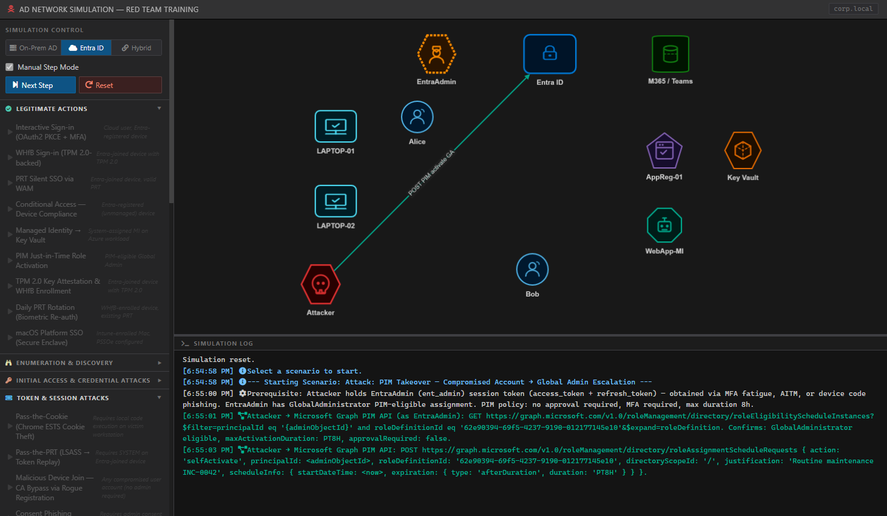

# AD Network Simulation - Red Team Training

An interactive web-based simulation tool for learning and practicing Active Directory attack techniques and defensive strategies. This tool provides a visual representation of AD network interactions and various attack scenarios commonly used in red team operations.

[CLICK HERE FOR THE ONLINE PAGE](https://elvisgraho.github.io/ad-simulator/)

